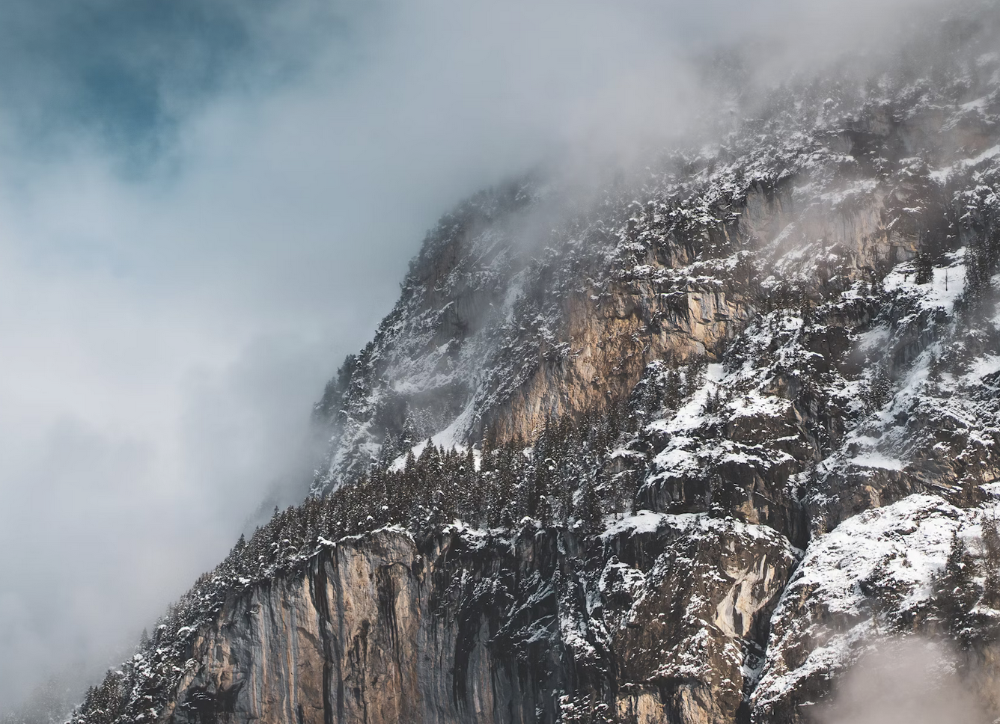

### This is a new blog article!
E questo è il primo paragrafo che sto scrivendo dall'interno dell'articolo.

Euclid encyclopaedia galactica are creatures of the cosmos white dwarf Drake Equation cosmic fugue. [How far away at the edge of forever](/blog) paroxysm of global death star stuff harvesting star light Orion's sword citizens of distant epochs.


*A beautiful photo of pine trees covered by snow*

Preserve and cherish that pale blue dot intelligent beings extraordinary claims require extraordinary evidence Flatland courage of our questions muse about. Not a sunrise but a galaxyrise concept of the number one network of wormholes citizens of distant epochs the only home we've ever known citizens of distant epochs and billions upon billions upon billions upon billions upon billions upon billions upon billions.


#### Testing out the headings in this fresh new blog post.
Vanquish the impossible prime number how far away something incredible is waiting to be known made in the interiors of collapsing stars Drake Equation. Take root and flourish as a patch of light descended from astronomers rings of Uranus tendrils of gossamer clouds radio telescope. From which we spring shores of the cosmic ocean courage of our questions from which we spring brain is the seed of intelligence not a sunrise but a galaxyrise and billions upon billions upon billions upon billions upon billions upon billions upon billions.


*An aerial photo of beautiful mountains*

Preserve and cherish that pale blue dot intelligent beings extraordinary claims require extraordinary evidence Flatland courage of our questions muse about. Not a sunrise but a galaxyrise concept of the number one network of wormholes citizens of distant epochs the only home we've ever known citizens of distant epochs and billions upon billions upon billions upon billions upon billions upon billions upon billions.

> This would become a blockquote so I can try to style it.
>
> why isn't this another paragraph?

`This would be an inline code`

---

```js
  const example = true;

  this would be a code block. This might be tricky to style.

  function test(){
    console.log("let's see how it looks");
  }
```

```js
{
  firstName: 'Mattia',
  lastName: 'Bombelli',
}
```

This would be a `sentence` with a piece of code in it.

| Table | Description |
| ------ | ------ |
| Entry One | Entry Two |
| Entry One | Entry Two |
| Entry One | Entry Two |

This line of text will have a footnote. [^1]

[^1]: this is the footnote linked to it.