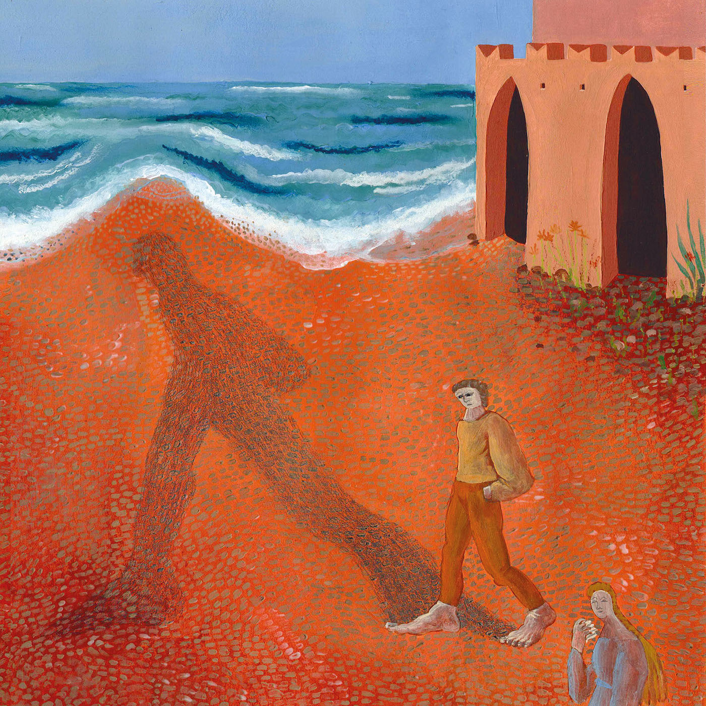
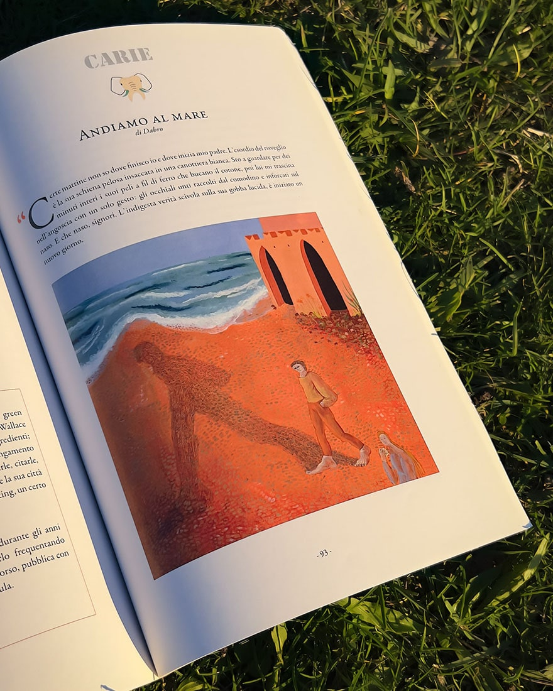

import Slide from '../../../components/illustration-slide.astro'

<Slide class="col-one-three text-slide">
	Illustration made for _Andiamo al mare_, story written by Dabro and published on the magazine [Carie Letterarie](https://www.carieletterarie.org/).
	\
	\
	–
	\
	\
	The protagonist, of whom we don't know the name, is stuck in a vicious cycle of dull worldliness. The plight is held together by a complicated relationship with his father, and Sam, his alter ego - and unrequited love.
</Slide>

<Slide class="col-one-six text-center"></Slide>

<Slide class="col-one-six text-center"></Slide>