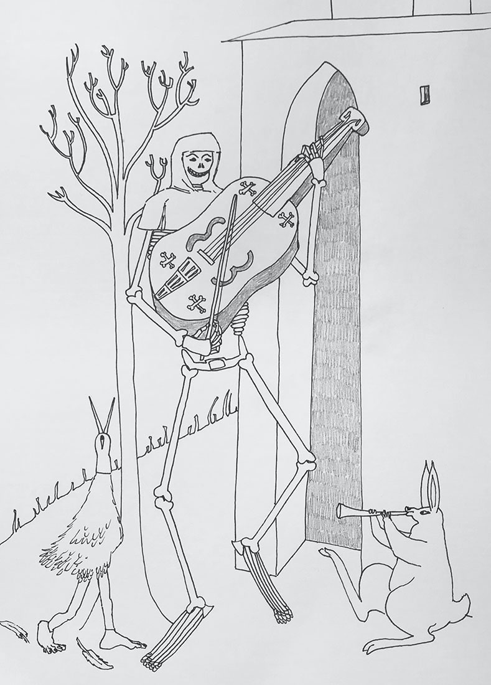
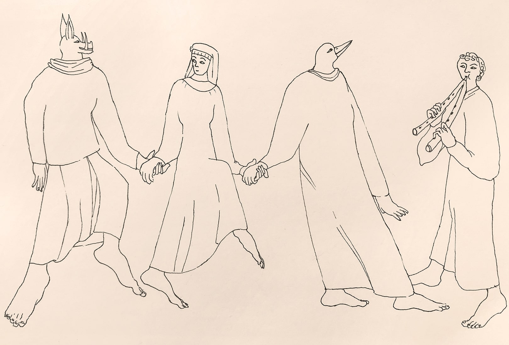
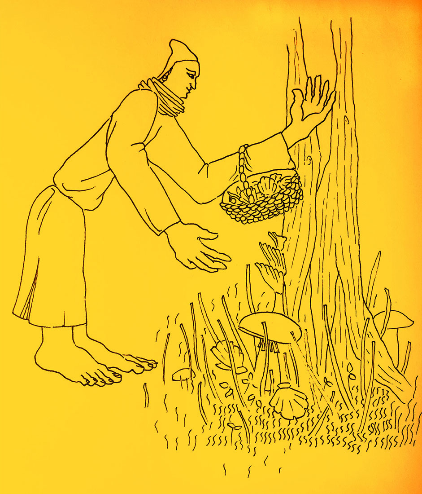

import Slide from '../../../components/illustration-slide.astro'

<Slide class="col-one-three text-slide">
A collection of illustrations made for the #juline challenge that takes place each year during the month of July.
</Slide>

<Slide class="col-one-three text-center"></Slide>

<Slide class="col-four-six text-center"></Slide>

<Slide class="col-one-six text-center"></Slide>

<Slide class="col-one-three text-center"></Slide>

<Slide class="col-four-six text-center"></Slide>
