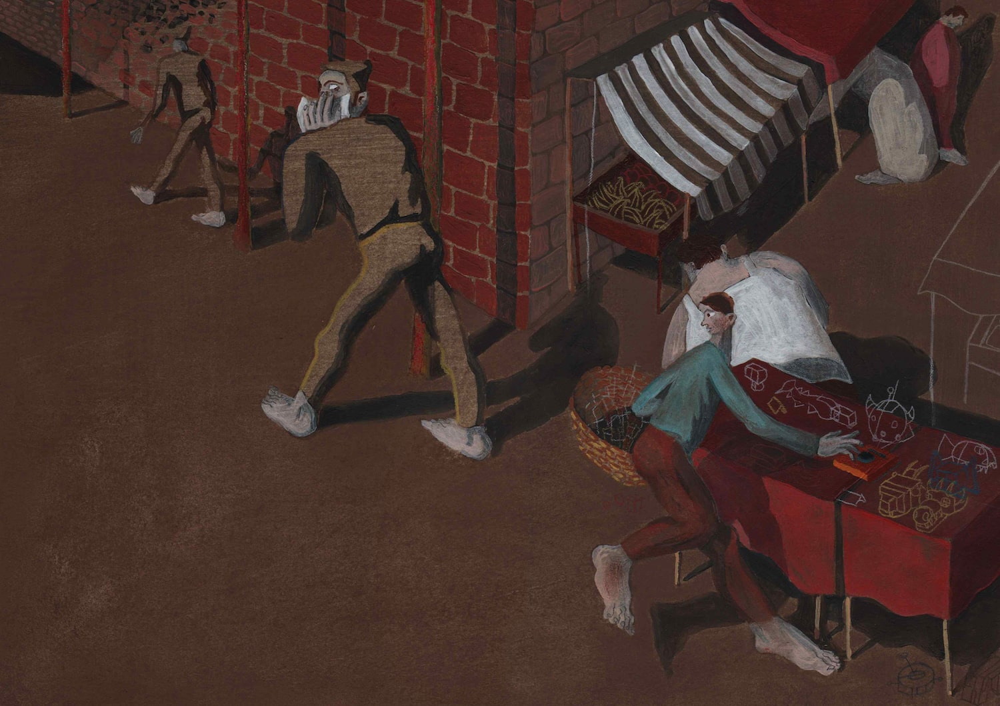

import Slide from '../../../components/illustration-slide.astro'

<Slide class="col-one-three text-slide">
	_Senza Ritorno_ is a story written by [Luigi Nalli](https://www.kimerik.it/autore/11083/luigi-nalli/) for the contest [Un Prato di Fiabe](https://www.associazionemarginalia.org/concorso-un-prato-di-fiabe-2018/).
	\
	\
	–
	\
	\
	Walter, a little kid chased by bullies, seeks help from the odd videogame merchant that everyone in town appears to stay away from.
	\
	\
	Through a bizarre device labeled "Senza Ritorno" (_No return_) he finds himself tossed in a whimsical and metaphysical town where there seems to be no way out. His only hope is to rely on the eccentric creatures he encounters along the way.
	\
	\
	–
	\
	\
	_Senza Ritorno_ was awarded an honor mention at the contest.
</Slide>

<Slide class="col-one-six text-center"></Slide>

<Slide class="col-one-six text-center"></Slide>
